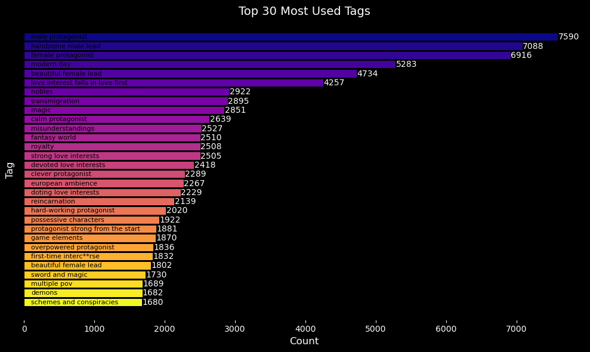
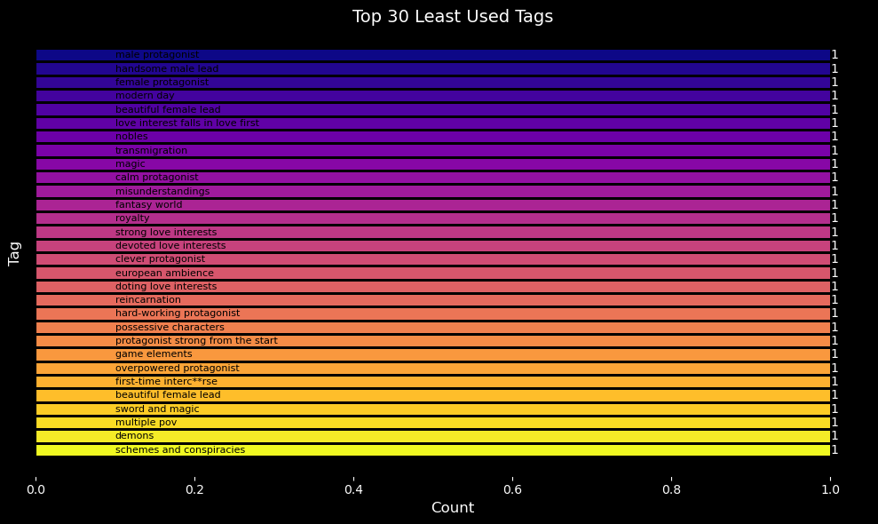
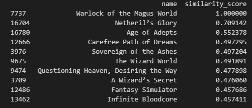

# novel-recommendation


``` vscode > select anaconda "novel-recommendations" env ```

``` "conda install scikit-learn" to install sklearn in anaconda.navigator environment ```


20,000+ novels

## Data exploration 

Description: Figure exploring tags used in different fictional works within novel database.




Description: Figure looking at the least used tags




Description: 
- Scatter plot of readers vs tags
- Novels with fewer tags correlate with fewer readers


## Similarity Model 

Description:
* We finished reading our novel and we want to determine which novel we should read next, so if we asked for novels according to how similar they are by 'tags' and 'genres'. What would we get?

- Here, novel "Reverend Insanity" is compared to our dataset of novels, by 'tags' and 'genres'. 
- Resulting in the following similarity scores in the figure below.
- Similarity values seemed moderate, top 10 ranging from 0.49 to 0.57
- So these were the top 10 novels with the most likeness to "Reverend Insanity".


* Note. In reality, many users have recommended the novel "Pursuit of The Truth" as a novel similar to "Reverend Insanity". And so, we can see that there is merit to factoring in a similarity model based on 'tags' and 'genres'.


Description:
* Additional example, using "Warlock of the Magus World" as the point of comparison.




* A next step in improvement, would be novel ratings, rankings, individual user-created reading lists, and potentially the fully detailed novel reviews left by users.
